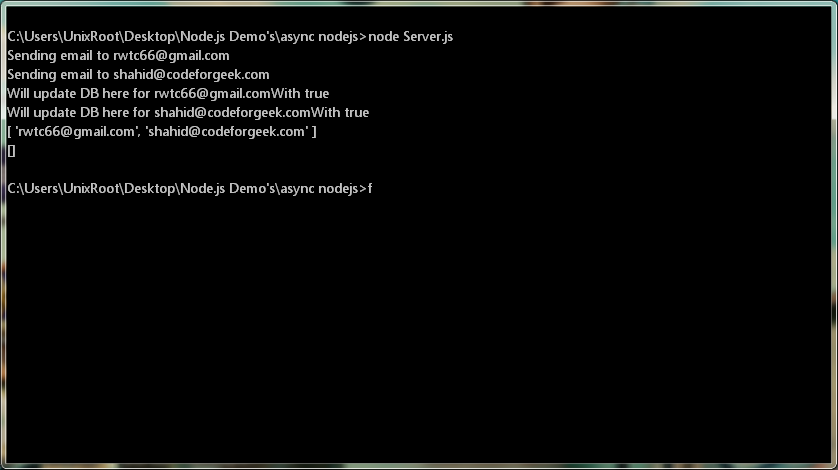
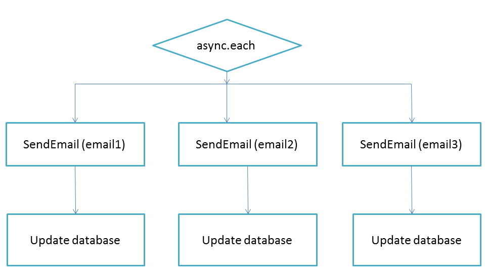

## Mass Mailer using Async
This script demonstrate use of Async package to build Mass Mailer which can send email to 1000's of user in parallel way.

### How to run

* Clone the script or download one.

* Type ```npm install``` if dependencies is not present.

* Run by using ```node Server.js``` and you should see following output.


### Explanation:

Script takes the email from array and execute email sending operation at once. So for more than 1 user it will send email to them at once. Once email is sent, it will update DB and return back to parent caller once done.



### Links & website :
Find tutorial here (http://codeforgeek.com/2015/04/nodejs-async-tutorial/).


